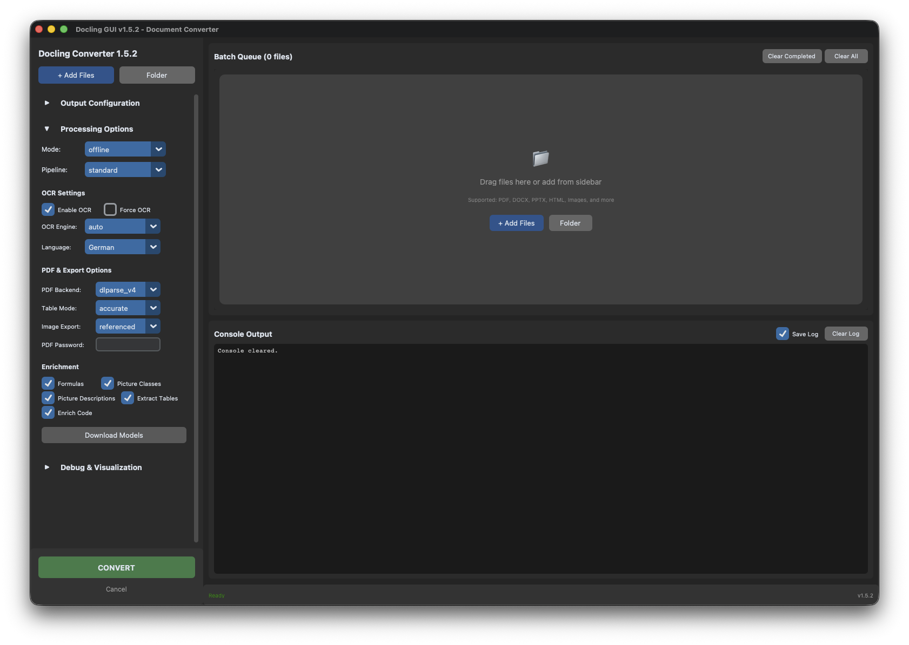

# Docling GUI

A user-friendly graphical interface for the [Docling](https://github.com/docling-project/docling) document converter. Convert PDFs, Word documents, PowerPoint presentations, HTML, images, and more to Markdown, JSON, HTML, or text formats with ease.



---

## Disclaimer

This project is a private hobby endeavor and is provided "as is," without any warranties of any kind, express or implied. The developer has no affiliation with Docling or any other third-party projects, tools, or libraries mentioned or used herein. Use at your own risk.

---

## Features

### Current Version: v1.5.2

#### Core Features
- **Batch Queue Processing**: Add multiple files or entire folders for sequential processing
- **Multiple Output Formats**: Markdown, JSON, HTML, HTML (split page), Text, Doctags
- **Configurable Output**: Choose output directory with quick access to open folder
- **Processing Modes**:
  - **Online Mode**: Default mode with automatic model downloads
  - **Offline Mode**: Privacy-focused, uses local model artifacts with pre-downloaded models
- **Real-time Console Output**: See Docling's processing output in real-time
- **Progress Tracking**: Visual feedback during conversion with queue statistics
- **Persistent Settings**: Remembers your preferences between sessions
- **Log File Support**: Optionally save console output to log files

#### OCR & Language Options
- **OCR Engine Selection**: Choose from 6 OCR engines (auto, easyocr, tesseract, rapidocr, ocrmac, tesserocr)
- **OCR Validation**: Pre-conversion checks with helpful installation instructions
- **Enable/Disable OCR**: Toggle Optical Character Recognition on/off
- **Force OCR**: Replace existing text with OCR output
- **OCR Languages**: Specify language codes (e.g., "eng", "deu", "fra")

#### Processing Pipelines
- **Standard Pipeline**: General document processing (recommended)
- **VLM Pipeline**: Vision Language Model for complex layouts
  - **VLM Model Selection**: Choose from 6 VLM models (smoldocling, granite_vision, got_ocr_2, etc.)
- **ASR Pipeline**: Audio/Speech Recognition for multimedia files

#### Advanced Options
- **Table Extraction**: Enable/disable table detection and extraction
- **Code Enrichment**: Enable code block enhancement
- **Formula Enrichment**: Improve mathematical formula detection
- **Picture Classification**: Classify image types
- **Picture Descriptions**: Generate image descriptions
- **Image Export Modes**: Placeholder, Embedded, or Referenced
- **Verbosity Control**: Adjust logging detail level (0, 1, 2)

#### Debug & Visualization
Collapsible debug section with 5 visualization toggles:
- **Show Layout Boxes**: Display bounding boxes on page images
- **Visualize Layout Clusters**: Debug layout detection
- **Visualize PDF Cells**: Show raw PDF cell detection
- **Visualize OCR Cells**: Show OCR cell detection
- **Visualize Table Cells**: Show detailed table structure

## Screenshot


The new sidebar interface shows:
- **Left Sidebar** with all conversion controls in collapsible sections
- **Add Files / Folder** buttons for batch queue management
- **Output Configuration** section (format, output directory)
- **Processing Options** with OCR engine, language, PDF backend, table mode
- **Debug & Visualization** collapsible section
- **Right Panel** with batch queue and console output
- **Queue Statistics** with Clear Completed / Clear All buttons

## Requirements

- **Python**: 3.9 - 3.14 (3.12+ recommended)
- **Operating System**: macOS or Windows 11
- **Dependencies**: See `requirements.txt`

## Installation

### 1. Clone or Download

```bash
cd /path/to/your/projects
git clone <repository-url> docling-gui
# or download and extract the ZIP file
cd docling-gui
```

### 2. Create Virtual Environment (Recommended)

**macOS/Linux:**
```bash
python3 -m venv venv
source venv/bin/activate
```

**Windows:**
```bash
python -m venv venv
venv\Scripts\activate
```

### 3. Install Dependencies

```bash
pip install -r requirements.txt
```

This will install:
- `customtkinter` - Modern UI framework
- `docling` - Document conversion library
- `Pillow` - Image processing support

### 4. Verify Docling Installation

```bash
docling --version
```

If this command fails, ensure Docling is properly installed:
```bash
pip install --upgrade docling
```

## Usage

### Starting the Application

```bash
python main.py
```

Or make it executable (macOS/Linux):
```bash
chmod +x main.py
./main.py
```

### Basic Workflow

1. **Select Input File**:
   - Click "Select File" button
   - Choose a document (PDF, DOCX, PPTX, HTML, image, etc.)

2. **Configure Output**:
   - Select output format from dropdown (default: Markdown)
   - Choose output directory (default: ~/Documents/docling_output)

3. **Set Processing Options** (optional):
   - Choose **Online** or **Offline** mode
   - Enable/disable OCR
   - Select processing pipeline (Standard, VLM, ASR)

4. **Convert**:
   - Click "Convert" button
   - Monitor progress in the console output
   - Wait for completion message

5. **Access Output**:
   - Click "Open Folder" to view converted files
   - Files are saved in your selected output directory

### Processing Modes

#### Online Mode (Default)
- Uses default model locations
- May download models as needed (requires internet)
- Always up-to-date with latest models
- **Best for**: Most users, first-time use

#### Offline Mode
- Uses local model artifacts from specified path
- No internet connections required
- Better for privacy and air-gapped environments
- **Best for**: Privacy-conscious users, secure environments

To configure offline mode:
1. Set artifacts path in settings (default: `~/.cache/docling`)
2. Ensure models are downloaded (will be downloaded on first use with internet)
3. Switch to "Offline" mode in the UI

### Output Formats

| Format | Extension | Description |
|--------|-----------|-------------|
| **Markdown** | `.md` | Structured text, ideal for documentation and notes |
| **JSON** | `.json` | Structured data, suitable for further processing |
| **HTML** | `.html` | Web-ready format with styling |
| **HTML (Split)** | `.html` | Separate HTML file per page |
| **Text** | `.txt` | Plain text, no formatting |
| **Doctags** | `.doctags` | Document with semantic tags |

### OCR Options

- **Enable OCR**: Extract text from images and scanned documents
- **Force OCR**: Replace existing text with OCR output (useful for poor-quality PDFs)

### Pipeline Options

- **Standard**: General document processing (recommended for most documents)
- **VLM**: Vision Language Model for complex layouts and visual elements
- **ASR**: Audio/Speech Recognition for video and audio files

## Configuration

Settings are automatically saved to:
- **macOS**: `~/Library/Application Support/DoclingGUI/config.json`
- **Windows**: `%APPDATA%\DoclingGUI\config.json`

The application remembers:
- Last used output directory
- Output format preference
- Processing mode (online/offline)
- OCR settings
- Window size and position

## Project Structure

```
docling-gui/
├── main.py                    # Application entry point
├── config.py                  # Configuration management
├── requirements.txt           # Python dependencies
├── README.md                  # This file
├── CLAUDE.md                  # Project guidance
├── core/
│   ├── __init__.py
│   ├── converter.py           # Docling CLI integration
│   └── queue.py               # Batch queue management
└── ui/
    ├── __init__.py
    ├── main_window.py         # Main window with two-panel layout
    ├── sidebar.py             # Left sidebar with all controls
    ├── queue_panel.py         # Batch queue visualization
    ├── console_panel.py       # Console output with logging
    └── widgets/               # Reusable UI components
        ├── __init__.py
        ├── collapsible_section.py
        ├── file_drop_zone.py
        └── queue_item_widget.py
```

## Troubleshooting

### "Docling CLI not found" Error

**Solution**: Install Docling:
```bash
pip install docling
```

Verify installation:
```bash
python -c "import docling; print(docling.__version__)"
```

### "Could not create output directory" Error

**Solution**:
- Check that the output directory path is valid
- Ensure you have write permissions
- Try selecting a different output directory (e.g., Desktop or Documents)

### Conversion Fails or Hangs

**Possible causes**:
1. **Large file**: Processing may take several minutes for large PDFs
2. **Corrupted file**: Try a different document
3. **Missing models**: In offline mode, ensure models are downloaded

**Solutions**:
- Check console output for specific errors
- Try with a smaller test file first
- Switch to online mode if in offline mode
- Ensure stable internet connection for online mode

### Application Won't Start

**Solution**:
```bash
# Reinstall dependencies
pip uninstall customtkinter docling -y
pip install -r requirements.txt

# Check Python version (should be 3.9-3.14)
python --version
```

### macOS: "Application is damaged" or Security Warning

**Solution**:
```bash
# If running from source, no code signing needed
# Just ensure you're running: python main.py
```

For packaged app (future):
```bash
xattr -cr DoclingGUI.app
```

## Development

### Running in Development Mode

```bash
# Activate virtual environment
source venv/bin/activate  # macOS/Linux
venv\Scripts\activate     # Windows

# Run with Python directly
python main.py
```

### Changing Theme

Edit `config.json` and change:
```json
"interface": {
  "theme": "dark"  // or "light" or "system"
}
```

Or the theme will be adjustable in settings (future feature).

## Roadmap

### ✅ Phase 1: MVP (v1.0.0 - v1.2.x) - COMPLETED
- Single file conversion
- Basic options and settings
- Online/offline modes
- Real-time console output

### ✅ Phase 2: Batch Processing (v1.3.0) - COMPLETED
- ✅ Queue multiple files for batch conversion
- ✅ Add folders recursively
- ✅ Per-file status tracking
- ✅ Batch progress overview

### ✅ Phase 3: Advanced Options (v1.4.0) - COMPLETED
- ✅ OCR engine selection and validation
- ✅ VLM model selection
- ✅ Debug visualization options
- ✅ Advanced processing parameters
- ✅ Table extraction and code enrichment

### ✅ Phase 4: UI Redesign (v1.5.x) - COMPLETED
- ✅ Two-panel sidebar layout for better organization
- ✅ Component-based modular architecture
- ✅ OCR engine and language dropdowns
- ✅ PDF backend and table mode selection
- ✅ PDF password support for protected documents
- ✅ Image export mode dropdown
- ✅ Collapsible sections (Output, Processing, Debug)
- ✅ Enhanced batch queue visualization

### Phase 5: Future Enhancements - PLANNED
- Drag & drop file support (tkinterdnd2)
- Configuration profiles (save/load presets)
- Keyboard shortcuts
- Settings dialog
- URL input support
- File preview panel

## Support

### Common Use Cases

**Convert PDF to Markdown**:
1. Select PDF file
2. Ensure "Markdown" is selected
3. Click Convert

**Extract Text from Scanned Document**:
1. Select image or scanned PDF
2. Enable "Force OCR"
3. Select "Text" format
4. Click Convert

**Process Document Offline**:
1. Switch to "Offline" mode
2. First time: Ensure internet for model download
3. After models downloaded: Works without internet
4. Click Convert

## License

This project is licensed under the MIT License. See the [LICENSE](LICENSE) file for details.

For third-party library license information, see the "Credits" section.

## Credits

- **[Docling](https://github.com/docling-project/docling)**: Document conversion engine by IBM Research and LF AI & Data Foundation
- **[CustomTkinter](https://github.com/TomSchimansky/CustomTkinter)**: Modern UI framework by Tom Schimansky
- **[Python](https://www.python.org/)**: Programming language
- **[Gemini (Google)](https://gemini.google.com/)**: AI assistant for code generation and analysis
- **[Claude (Anthropic)](https://www.anthropic.com/claude)**: AI assistant for code generation and analysis

## Version History

### v1.5.2 - UI Redesign with Sidebar Layout (Current)
**Release Date:** 2025-12-13
**Phase:** Phase 4 - UI Redesign

**Major Changes:**
- Complete UI redesign with two-panel sidebar layout
- Component-based modular architecture
- New widgets directory with reusable components

**New Features:**
- OCR Engine dropdown (auto, easyocr, tesseract, tesserocr, rapidocr, ocrmac)
- OCR Language dropdown (18 languages with friendly names)
- PDF Backend dropdown (pypdfium2, dlparse_v1, dlparse_v2, dlparse_v4)
- Table Mode dropdown (fast, accurate)
- Image Export Mode dropdown (placeholder, embedded, referenced)
- PDF Password field for protected documents
- Collapsible sections for Output, Processing, and Debug options
- Enhanced batch queue visualization with status indicators

**New Files:**
- `ui/sidebar.py` - Left sidebar with all controls
- `ui/queue_panel.py` - Batch queue visualization
- `ui/console_panel.py` - Console with Clear Log
- `ui/widgets/` - Reusable UI components

---

### v1.4.0 - Advanced Debug & Visualization
**Release Date:** 2025-12-13
**Phase:** Phase 3 - Advanced Options

**New Features:**
- OCR Engine selection (6 engines with availability validation)
- VLM Model selection (6 model options)
- Extract Tables toggle
- Enrich Code toggle
- Advanced Debug & Visualization section (5 toggles)

**Improvements:**
- OCR engine pre-validation with helpful error messages
- Better error handling in batch processing
- Installation instructions for missing dependencies

**Bug Fixes:**
- Fixed TypeError with missing convert() parameters
- Fixed AttributeError in queue widget updates

[Full Release Notes](https://github.com/crashdown79/docling-gui/releases/tag/v1.4.0)

---

### v1.3.0 - Batch Processing
**Release Date:** 2025-12-13
**Phase:** Phase 2 - Batch Processing

**New Features:**
- Batch queue system for multiple files
- Add files and folders with recursive scanning
- Per-file status tracking with color-coded icons
- Queue statistics and management
- Collapsible queue interface

[Full Release Notes](https://github.com/crashdown79/docling-gui/releases/tag/v1.3.0)

---

### v1.2.x - Feature Enhancements
- Image export mode selection
- Verbose mode control
- Model download functionality
- Enrichment options (formulas, pictures)
- Log file support
- Offline mode validation and fixes

---

### v1.0.0 - MVP Release
- Initial release with core features
- Single file conversion
- Online/offline processing modes
- Real-time console output
- Basic error handling
- Persistent configuration

## Contributing

Contributions welcome! Areas for improvement:
- Drag-and-drop file support
- Batch processing queue
- Advanced options panel
- Configuration profiles
- Unit tests
- Platform-specific packaging

## Contact

For issues, feature requests, or questions, please open an issue on the project repository.

---

**Note**: This is an MVP (Minimum Viable Product) release. Additional features are planned for future releases. See FEATURE_ANALYSIS.md for the complete feature roadmap.
